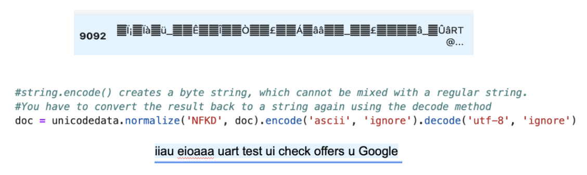

# NLP Model For Sentiment Analysis

## Project Overview
The subject of our Twitter/ X data centers at the 2013 SXSW conference here
South by Southwest (SXSW) is a multi-conference event of interactive media, music, and film that occurs in Austin, Texas each year in March. Each tweet in our data mentions either Apple products, Google products, or both as well as specific products under those brands. We dropped instances were no apple or google product was mentioned. Our goal is to analyze sentiment from tech conference and predict future growth based on sentiment that can be traslated to purchase as a step in developing a model for consulting the average retail investor.

## Data Understanding
Number of Instances: 9,093
Data for apple products represented 5517
Data for Google products represented 2764
Data with no google or apple mention represented 784 
We used encoding 'unicode_escape' to encode the text data, and added another layer of encoding and decoding in our cleaning as there were still texts not translating to something we could read. We removed hashtags, URL and other expressions that were not letters using regex, we lowercase everything to reduce repeating words and lettimized using noun, verb, adjective and adverb. This gave use texts to work with and upon further analysis we decided to keep words that had more than 2 words as we noticed repeating aa, ab, rt and more abbreviations that we couldn’t generate real meaning for. We also grouped mentioned products as either apple or google removing tweets with no product mentioned. We noticed bigrams and ungrams were key in our analysis, as trigrams didn’t have that much difference from bigrams in meaning and distribution.

* One main problem we had even after encoding and using regex and .re to clean text was certain 
expressions where not encoded right. Here is what we used along removing hashtags and regex expression that weren't words.
Maybe not the best tweet to encode but hey the method works :)

## Modeling Process
Our data was unbalanced with 7% negative, 58% positive and 35% who had no emotion or couldn’t tell their feelings from the tweet. We tried modeling with Countvector and TF-IDF, we tried to balance our data with smote and embedding techniques to reduce dimension, such as negative matrix factorization, Turnicated SVD and LatentDirichletAllocation embedding techniques unfortunately our data was not enough and dimension reduction couldn’t help our models performance. Although we did get pretty balanced across all metrics with logistic regression and LatentDirichletAllocation, the best performer given the amount of data was Logistic regression with TF-IDF. Model performance across all models had a weakness of predicting negative emotion with certain data splits having no instance of tweet corpus with negative emotion. 

## NLP Recommendations 
 In conclusion, to optimize text processing and enhance model performance, it is pivotal to utilize unicode. normalize for rectifying encoding mismatches during data loading. Moreover, across various models tested, TF-IDF consistently outperformed other vectorization techniques. While embedding methods like Latent Dirichlet Allocation demonstrated promise in balancing outcomes across classes, to truly harness its potential and achieve optimal results, there is a pressing need to either augment the dataset or consider transitioning to a deep learning framework.

## Limitations
* Tweets are often accompanied with emojis, capital letters to represent certain enotion as well as punctuations such as exclimation mark, our cleaning process removes those and certain sentioment could be lost.
* Our data as mentioned above was severly imbalanced leading to less predictive power of negative emotion instances.

## Next Steps
* Collect more data
* Deploy deep learning algorithms
 
### Notebooks
* [Notebooks](notebooks) 

* [FinalNotebook](final_notebook.ipynb)

  

## Linkedin
Gavin Martin   
Claire Sarraillé   
Deniz Emre   
Danayt Aman   
